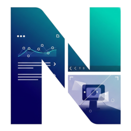

#  NexusViewPanel Integration

[](https://github.com/hacs/integration)
[](https://github.com/smintlife/nexusviewpanel_ha_integration/releases)
[](https://github.com/smintlife/nexusviewpanel_ha_integration/issues)

This integration connects your [NexusViewPanel](https://www.smintlife.de/nexus) application to Home Assistant, allowing you to control and automate your panel.


---

## 📇 Entities

### Switch

| Entity | Name | Description |
|--------|------|-------------|
| `switch.display` | Display | Turns the screen on and off. |

### Number

| Entity | Name | Description |
|--------|------|-------------|
| `number.configured_brightness` | Configured Brightness | Slider (0–100) to set the app's configured brightness. |

### Select

| Entity | Name | Description |
|--------|------|-------------|
| `select.active_tab` | Active Tab | Dropdown to view and switch the currently active tab. |

### Sensor

| Entity | Name | Description |
|--------|------|-------------|
| `sensor.battery` | Battery | Device battery level (%). Attributes: `device_model`, `manufacturer`, `android_version`. |
| `sensor.active_tab` | Active Tab | Currently active tab title. Attributes: `active_tab_index`, `is_floating_tab_active`. |

### Binary Sensor

| Entity | Name | Description |
|--------|------|-------------|
| `binary_sensor.charging` | Charging | Whether the device is currently charging. |
| `binary_sensor.kiosk_mode` | Kiosk Mode | Whether Kiosk Mode is enabled. |
| `binary_sensor.fullscreen` | Fullscreen | Whether Fullscreen mode is enabled. |
| `binary_sensor.reload_on_reselect` | Reload on Reselect | Whether tabs reload on reselection. |
| `binary_sensor.reload_on_swipe` | Reload on Swipe | Whether tabs reload on swipe. |
| `binary_sensor.reload_on_wakeup` | Reload on Wakeup | Whether tabs reload on device wakeup. |
| `binary_sensor.run_on_reboot` | Run on Reboot | Whether the app starts on device reboot. |
| `binary_sensor.device_admin_lock` | Device Admin Lock | Whether Device Admin Lock is enabled. |
| `binary_sensor.tabs_swipable` | Tabs Swipable | Whether tab swiping is enabled. |
| `binary_sensor.floating_view_enabled` | Floating View Enabled | Whether the floating view is enabled. |
| `binary_sensor.pin_protection` | PIN Protection | Whether PIN protection is enabled. |

> **Note:** The config-based binary sensors (Kiosk Mode, Fullscreen, etc.) are disabled by default and must be manually enabled after setup.

### Button

| Entity | Name | Description |
|--------|------|-------------|
| `button.close_floating_view` | Close Floating View | Closes the currently active floating window. |
| `button.reload_all_tabs` | Reload All Tabs | Forces a reload of all configured tabs. |
| `button.get_device_info` | Get Device Info | Forces an immediate refresh of device info (battery, etc.). |
| `button.get_config` | Get Config | Forces an immediate refresh of the app configuration. |
| `button.reload_{tab_title}` | Reload {Tab Title} | Forces a hard reload of a specific tab. *(Created dynamically for each tab.)* |
| `button.float_{tab_title}` | Float {Tab Title} | Opens a specific tab in the floating window. *(Created dynamically for each tab.)* |

---

## ⭐ Services (Actions)

These services can be called from automations and scripts via `nexusviewpanel.<service_name>`.

### `nexusviewpanel.select_tab`
Switch the active tab on the NexusViewPanel device.

| Parameter | Type | Required | Description |
|-----------|------|----------|-------------|
| `tab_index` | integer | yes | Zero-based index of the tab to select. |

### `nexusviewpanel.reload_tab`
Force a hard reload of a specific tab.

| Parameter | Type | Required | Description |
|-----------|------|----------|-------------|
| `tab_index` | integer | yes | Zero-based index of the tab to reload. |

### `nexusviewpanel.float_tab`
Open a specific tab in the floating window.

| Parameter | Type | Required | Description |
|-----------|------|----------|-------------|
| `tab_index` | integer | yes | Zero-based index of the tab to open in the floating view. |

### `nexusviewpanel.reload_all_tabs`
Force a reload of all configured tabs. *(No parameters.)*

### `nexusviewpanel.update_webview_tab`
Update the properties of an existing WebView tab.

| Parameter | Type | Required | Description |
|-----------|------|----------|-------------|
| `tab_index` | integer | yes | Zero-based index of the WebView tab to update. |
| `title` | string | no | New title for the tab. |
| `url` | string | no | New URL for the WebView to load. |
| `scale` | integer | no | Zoom scale percentage (e.g. 100 for 100%). |
| `offset_x` | integer | no | Horizontal offset in pixels. |
| `offset_y` | integer | no | Vertical offset in pixels. |

### `nexusviewpanel.update_rtsp_tab`
Update the properties of an existing RTSP tab.

| Parameter | Type | Required | Description |
|-----------|------|----------|-------------|
| `tab_index` | integer | yes | Zero-based index of the RTSP tab to update. |
| `title` | string | no | New title for the tab. |
| `url` | string | no | New RTSP stream URL. |
| `rtsp_transport` | string | no | Transport protocol: `AUTO`, `UDP`, or `TCP`. |
| `rtsp_decoder` | string | no | Decoder: `AUTO`, `SOFTWARE`, or `HARDWARE`. |
| `audio_enabled` | boolean | no | Enable audio for the RTSP stream. |

### Example: Select a Tab via Automation

```yaml
action:
  - service: nexusviewpanel.select_tab
    data:
      tab_index: 2
```

### Example: Update a WebView Tab via Automation

```yaml
action:
  - service: nexusviewpanel.update_webview_tab
    data:
      tab_index: 0
      title: "Home Assistant Dashboard"
      url: "http://homeassistant.local:8123"
      scale: 100
```

---

## 🛠️ Prerequisites

1.  A running Home Assistant instance.
2.  [HACS (Home Assistant Community Store)](https://hacs.xyz/) must be installed.
3.  The **NexusViewPanel** app running on a device.
4.  The **API function** must be enabled within the app (this generates your API token and port).

---

## ⚙️ Installation

This integration is available as a "Custom Repository" in HACS.

1.  In your Home Assistant instance, go to **HACS**.
2.  Click on **"Integrations"** and then click the three-dot menu in the top right.
3.  Select **"Custom repositories"**.
4.  In the "Repository" field, paste the following URL: [https://github.com/smintlife/nexusviewpanel_ha_integration](https://github.com/smintlife/nexusviewpanel_ha_integration)
5.  In the "Category" field, select **"Integration"**.
6.  Click **"Add"**.
7.  Close the window. The "NexusViewPanel" integration will now appear in HACS.
8.  Click **"Install"** and follow the prompts.
9.  **Restart Home Assistant** when prompted by HACS.

### Manual Installation (Alternative)

1.  Download the [latest release](https://github.com/smintlife/nexusviewpanel_ha_integration/releases).
2.  Copy the `custom_components/nexus_view_panel` folder into the `config` directory of your Home Assistant instance.
3.  Restart Home Assistant.

---

## 🔧 Configuration

After installation, the integration is configured via the UI:

1.  Go to **Settings > Devices & Services**.
2.  Click **"Add Integration"** in the bottom right.
3.  Search for **"NexusViewPanel"** and select it.
4.  You will have two options to add your device:

### Option A: Via QR Code (Recommended)

1.  Select **"Connect using QR Code String"**.
2.  Open your NexusViewPanel app, go to API settings, and tap "Show QR Code".
3.  Scan this QR code with your **smartphone's native camera app** (not the Home Assistant app).
4.  Copy the text your camera provides (it starts with `http://...`).
5.  Paste this entire string into the field in Home Assistant.

### Option B: Manual Entry

1.  Select **"Connect by entering details manually"**.
2.  Enter the **IP Address**, **Port**, and **API Token** shown in your NexusViewPanel app's API settings.

### Final Step

1.  **Device Name:** Provide a friendly name for your device (e.g., "Living Room Wall Tablet").
2.  **Polling Intervals:** Adjust the intervals (in seconds) for how often Home Assistant should poll the device status (battery) and the config status (tabs, settings).
3.  Click "Submit".

The integration is now set up, and all entities are available!

---

## 🤝 Contributing

Issues and pull requests are warmly welcome. If you find a problem, please create an [Issue](https://github.com/smintlife/nexusviewpanel_ha_integration/issues).

## 📄 License

MIT License (See `LICENSE` file for details)